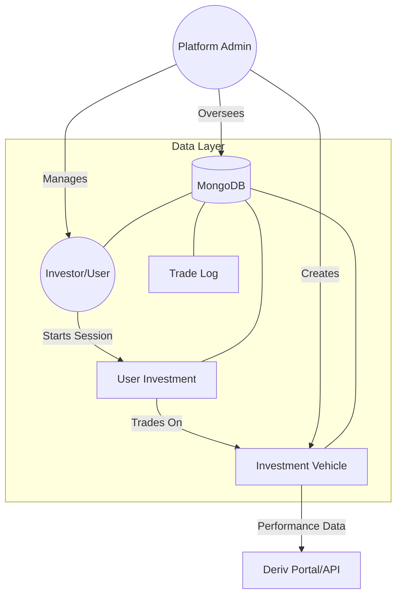
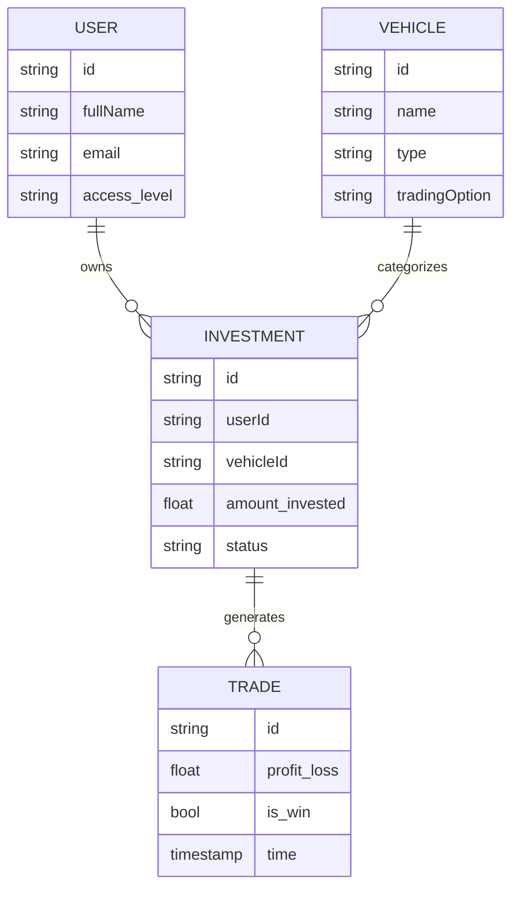
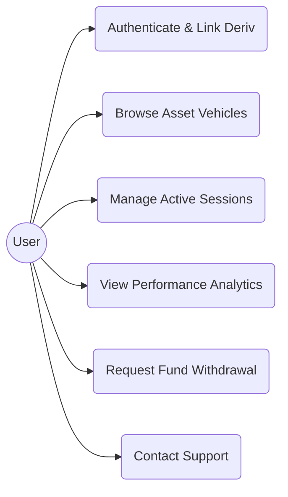
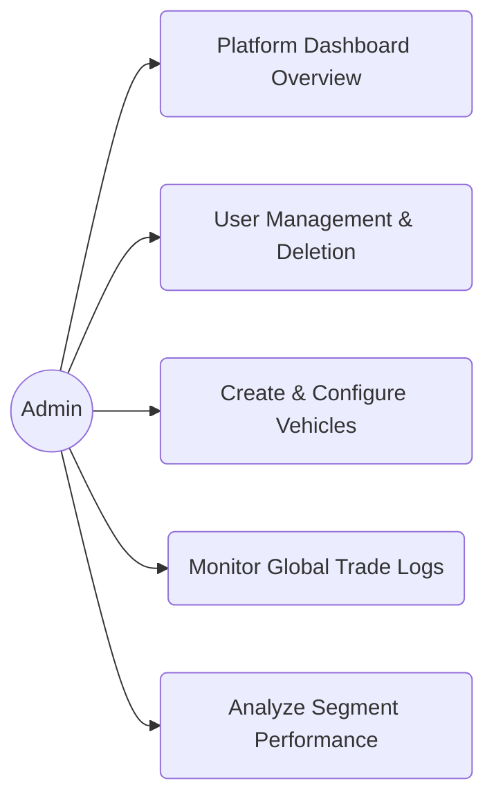

# Drink & Deryve

Drink & Deryve is a professional investment management platform designed to allow users to invest in various asset classes (Fleet, Logistics, Economy, Luxury) with integrated performance tracking and seamless access to the Deriv trading portal.

---

## 🚀 Tech Stack & Choices

### **Frontend: Flutter**
- **Material 3**: Utilized for a modern, responsive UI design.
- **Typography**: Standardized to **Josefin Sans** (`Josefine`) globally with a base size of **17px**. This choice ensures a sophisticated and readable aesthetic across all devices.
- **Animations**: Custom-built animations for navigation (Hollow Bottom Nav with fill-up effect) and Splash Screen (Spinning ring and slide-in text) to provide a premium user experience.
- **State Management**: Using `ChangeNotifier` and `BehaviorSubject` (RxDart) for real-time data streaming and UI updates.

### **Backend: Node.js & Express**
- **Express.js**: Chosen for its lightweight and flexible REST API architecture.
- **REST API**: Provides a secure and scalable bridge between the Flutter frontend and the database.
- **Environment**: Configured for `localhost` development with ready-to-deploy variables for production.

### **Database: MongoDB & Atlas**
- **Flexible Schema**: MongoDB's document-oriented structure perfectly fits the evolving models of Vehicles, Users, and Investments.
- **MongoDB Atlas**: The platform is architected to transition seamlessly from a local instance to **MongoDB Atlas (Cloud)** for global scaling and high availability.

---

## 🛠 Project Structure

### **Folders**
- **`/api`**: Contains the complete Node.js backend.
    - `app.js`: Express app logic (separated for testing).
    - `server.js`: Server entry point and DB connection.
    - `seed.js`: Standalone script to populate the database with initial UAT data.
    - `run.sh`: Automated bash script to install, seed, and start the backend.
- **`/api/test`**: Dedicated folder for backend verification.
- **`/lib/src/api`**: Flutter-side REST client logic.
- **`/lib/src/models`**: Standardized data structures for Users, Vehicles, and Trades.
- **`/assets`**: Project resources including high-resolution vehicle images and custom fonts.

---

## 📡 REST API & Endpoints

The backend exposes a full suite of RESTful services:

### **Auth**
- `POST /api/login`: Validates user and admin credentials. Supports the primary admin account: `deriver@admin` (Pass: `DerivProfit`).

### **User Management**
- `GET /api/users`: Retrieves all registered users.
- `POST /api/users`: Registers a new user.
- `DELETE /api/users/:id`: Removes a user and cascades deletion to all their active investments. **Note**: Also triggers a simulated email sending the user their Deriv details for independent access.

### **Vehicle Management**
- `GET /api/vehicles`: Fetches the list of available investment assets.
- `POST /api/vehicles`: Admin endpoint to create new investment vehicles with custom images, asset types, and risk levels.

---

## 🧪 Testing (UAT & Functional)

We use **Jest** and **Supertest** for a rigorous testing workflow.

### **Categories**
- **Functional Testing**: Verifies CRUD operations for Users and Vehicles to ensure data integrity.
- **UAT (User Acceptance Testing)**: Validates critical business paths like Admin Login and the "User Deletion" logic (ensuring all assets are correctly unlinked upon account closure).

### **How to Run Tests**
```bash
cd api
npm test
```

---

## 📈 Recent Enhancements

- **Branding**: Implemented **Sentence case** for all button text and fixed currency spacing (e.g., `R 10,500.00`).
- **Navigation**: The Bottom Nav is now **collapsible** with an animated "lip." Selecting an icon triggers a color-fill animation that completes as the page content loads.
- **Admin Suite**:
    - **Vehicle Management**: Added a Floating Action Button (FAB) for creation.
    - **Interactive Analytics**: Pie charts now support **drill-down** into bar graphs showing specific user activity.
    - **Trade Detail View**: Provides a granular breakdown of how individual trades affect both user balances and platform revenue.
- **Performance**: Integrated a **1-second navigation buffer** with a branded spinning red loader to prevent UI flickering.

---

## 🤝 Stakeholders & DB Relations

Below is the architectural mapping of the Drink & Deryve ecosystem and how stakeholders relate through the database schema.

### **Stakeholder Relationship Map**


### **Database ER Diagram**


---

## 📋 UML Use Case Diagrams

The following diagrams detail the functional requirements for different user roles.

### **User (Investor) Use Cases**


### **Admin Use Cases**


---

## 💹 Deriv Integration

The platform is built on top of the **Deriv Ecosystem**.

- **Webview Portal**: Provides a secure, full-screen bridge to `app.deriv.com`.
- **Deriv API**: Future-ready hooks implemented to pull real-time market data directly into vehicle performance graphs.
- **Independent Access**: The platform ensures that even if a user is removed from our management system, their core Deriv account remains intact and accessible directly through the official Deriv website.

---

## 🛠 Installation & Setup

1. **Backend**:
   ```bash
   cd api
   chmod +x run.sh
   ./run.sh
   ```
2. **Frontend**:
   ```bash
   flutter pub get
   flutter run
   ```
